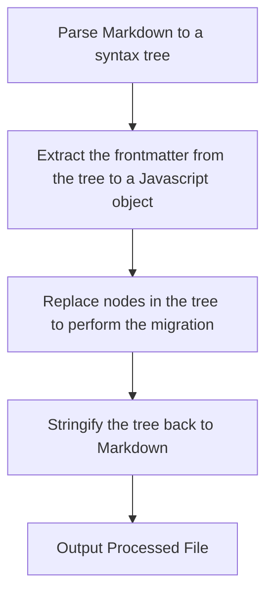

# Linaro Blog Migrator

This repo was used to migrate content from [the old Linaro website](https://github.com/Linaro/website) to [the new Linaro website](https://github.com/Linaro/linaro-astro). There is currently one script which is designed for migrating old content to new content. However this script could be easily adapted to migrate content in the new website to a different format.

## Dependencies

The blog migrator requires Node.js >= 18 and the `npm` package manager. 

Before using it, install depdencies with:

```bash
npm install
```

If images are being uploaded to Cloudinary, the credentials must be placed in a `.env` file:

```
CLOUDINARY_CLOUD_NAME='your_cloud_name'
CLOUDINARY_API_KEY='your_api_key'
CLOUDINARY_API_SECRET='your_api_secret’
```

## Migrating Old Content

**NOTE: The blogs from before 2023 have already been migrated using this script and there is an open PR [here](https://github.com/Linaro/linaro-astro/pull/78). Before using this script, check that the content you are migrating hasn't already been migrated.**

The current script located at [`migrate-old.mjs`](./migrate-old.mjs), performs the following actions:
- Migrates frontmatter from the old schema to the new schema
- Uploads images to Cloudinary and replaces the referenced path with the Cloudinary path
- Removes [jekyll liquid templates](https://jekyllrb.com/docs/liquid/) and replaces them as necessary
- Saves the files as `.mdx` instead of `.md` to facilitate the use of [`@astrojs/mdx`](https://docs.astro.build/en/guides/integrations-guide/mdx/) features
- Migrates tags to a significantly reduced tag list

### Using the Script

To use the script as it is, pull the old website into a folder e.g. `./website`. Then set the directory variables at [the top of the script](./migrate-old.mjs#L16):

```ts
const INPUT_AUTHORS_FOLDER = "./old_content/authors";
const INPUT_BLOGS_FOLDER = "./old_content/blogs";
const OLD_WEBSITE_PATH = "./website";
const OUTPUT_FOLDER = "./new_content";
```

Create the relevant "input" directories and move any desired content into them from the old website. Then run the script:

```ts
node migrate-old.mjs
```
The migrated files should then be in the specified `OUTPUT_FOLDER`. 

To ensure the migrated files are valid, the content should then be copied into the new Linaro website content collections. Run `yarn build` and check for errors. 

### How it Works

The script uses [`unified`](https://www.npmjs.com/package/unified) to inspect and transform the content. A range of plugins are used for different purposes:
- [`remark-parse`](https://www.npmjs.com/package/remark-parse) - turns the markdown into a syntax tree
- [`remark-frontmatter`](https://www.npmjs.com/package/remark-frontmatter) - extracts the frontmatter into a syntax tree
- [`remark-extract-frontmatter`](https://www.npmjs.com/package/remark-extract-frontmatter) - converts the frontmatter section of the syntax tree into a Javascript object
- [`remark-stringify`](https://www.npmjs.com/package/remark-stringify) - serializes the transformed content back to markdown from the syntax tree
- [`remark-gfm`](https://www.npmjs.com/package/remark-gfm) - provides GitHub flavoured markdown support

There is then a custom `use` function which performs the migration. Broadly speaking, this function replaces "nodes" in the syntax tree as necessary for the migration. 

First the frontmatter is inspected, transformed and then replaced with the transformed version. Then, several [`visit` blocks](https://github.com/unifiedjs/handbook?tab=readme-ov-file#visitors) are used to transform specific node types, e.g. removing liquid templates from `paragraph` blocks or uploading inline images to Cloudinary from `image` blocks.

The overall flow is as follows:


### Common Problems

#### Failed Image Uploads

Certain images just refuse to upload for no obvious reason. Those can be manually uploaded via the Cloudinary UI. Once they are in place at the correct url, Cloudinary will skip over them due to the `overwrite: false` configuration.

#### .mdx problems

At the time of creating this script, there was no obvious way to convert `.md` to `.mdx`, so the files are simply created as `.md` files with `unified` and then saved as `.mdx` files. This works for 99% of content, but certain things break it, especially the use of angle bracket characters `>,<` e.g. in links of the format `<https://www.google.com>`, or `<br>` tags with no terminating slash. 

Most of these issues are caught by the addition of [an extra unified pipeline using the `remarkMdx` plugin](./migrate-old.mjs#L305) which attempts to parse the outputted file as `.mdx`. In other cases these problems will be noticeable when running `yarn build` with the content in the new website.

In most cases, the best thing to do is to simply manually fix the issue. If it is a persistent issue it could be fixed by the addition of a dedicated `visit` block.

## Migrating New Content

It might be desirable to change the schema of the new website, at which point this migrator could be adapted to facilitate that. This would require the creation of a new script, that would be largely similar to the script for migrating old content. Except:
- It would not be necessary to reupload images to Cloudinary
- It would not be necessary to handle jekyll liquid template tags